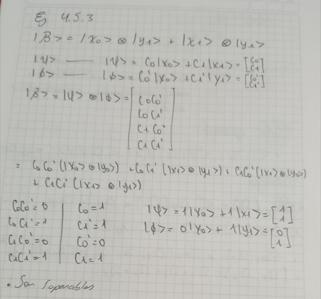

# TEORÍA CUÁNTICA BÁSICA, OBSERVABLES Y MEDIDAS
# Descripción y funcionamiento de funciones
 
* normvec: Esta función tiene como entrada un vector, para luego, dar como respuesta el vector normalizado correspondiente al vector de entrada.
  Para esto se utilizó un condicional para saber si el vector ya esta normalizado o no, si no, se divide cada posición por su norma. 

* prob:  Esta función como entrada recibe un vector de estados, para dar como salida la probabilidad de que la “canica” se encuentra en una posición especifica.
* amptrans: Esta función recibe dos vectores los cuales se normalizarán claramente si no están normalizados, para luego, dar como resultado la amplitud de transición.
* probtrans:  Esta función permite la entrada de dos vectores y calcular la probabilidad de transitar del uno al otro después de hacer la observación.
* valEsp: Esta función retorna el valor esperado.
* var:  Esta función revisa que la matriz sea hermitiana, y si lo es, calcula la media y la varianza del observable en el estado dado.
* med: Esta función  calcula los valores propios del observable y la probabilidad de que el sistema transite a alguno de los vectores propios después de la observación.

# Ejercicios 4.3.1, 4.3.2, 4.4.1, 4.4.2

* En el ejercicio 4.3.2 se calcula la probabilidad de que el vector de estados caerá dentro de uno de los vectores propios.
* En el ejercicio 4.4.2 se tienen dos matrices donde se multiplican y luego se verifica mediante un condicional si el resultado es una matriz unitaria.
* En el ejercicio 4.4.2 se tiene una matriz y un vector de estado inicial, luego se determina el estado del sistema luego de tres pasos de tiempo y se calcula la probabilidad de que la canica cuántica se encuentre en el punto 3.

# Para realizar la librería se uso el lenguaje de programación Python 

# Ejecución de la libreria 
 
 Para probar o usar la librería se deben hacer los siguietes pasos:

* [ ] Si no se tiene instalado el lenguaje de programación, ir a la siguiente  página web e instalar el lenguaje, siguiendo los pasos recomendados 
  [python.org](https://www.python.org/)

* [ ] Descargar el repositorio.

* [ ] Guardarla donde se necesite su aplicación.

## Ejercicio 4.5.3

